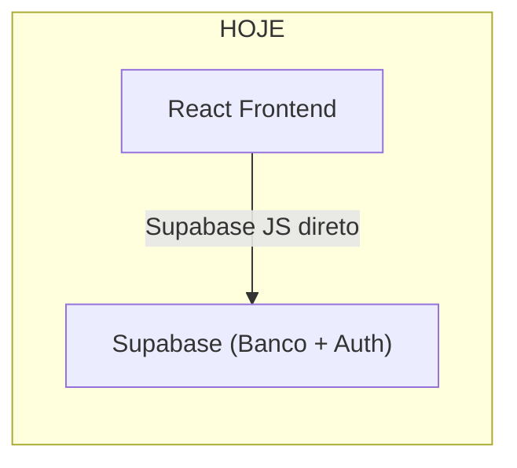
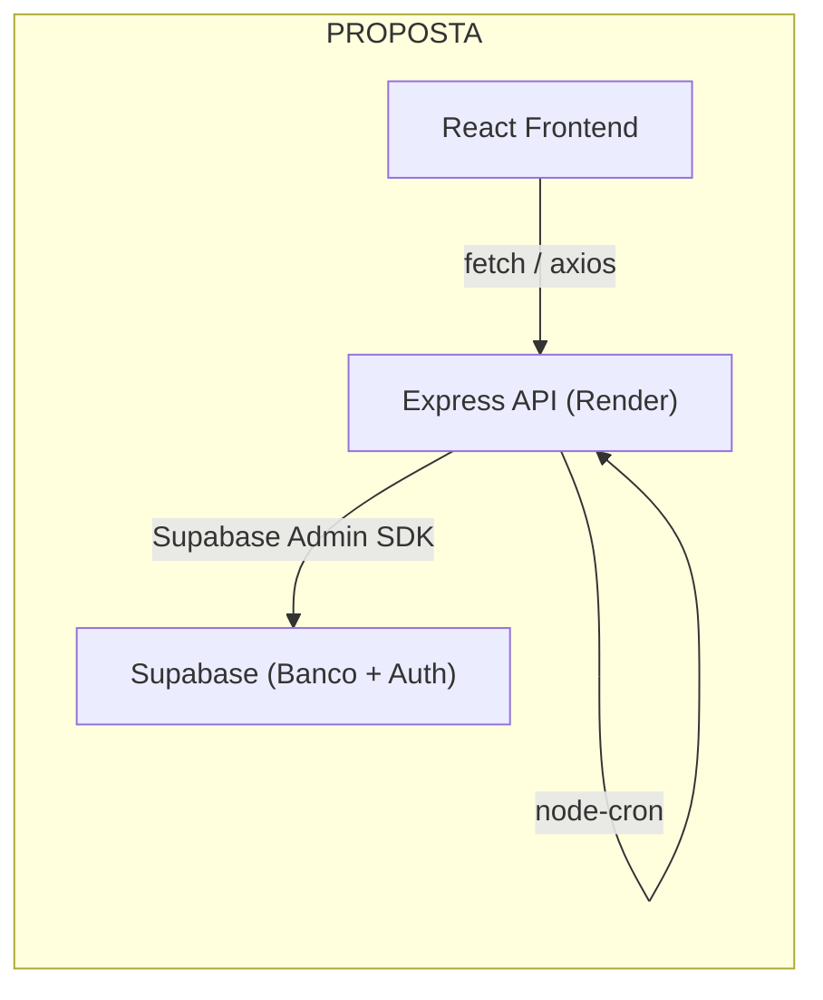

# Backend Real com Express + TypeScript para o FinançasApp

Migrar toda a lógica de negócio (queries ao Supabase, geração automática de transações fixas, validações) do frontend para um backend Express + TypeScript, que será deployado no Render.

## Arquitetura Atual vs. Proposta





## User Review Required

> [!IMPORTANT]
> **Autenticação**: O frontend **continuará usando o Supabase Auth diretamente** para login/cadastro/recuperação de senha. Apenas as chamadas de dados (CRUD) passarão pelo backend. Isso simplifica bastante a migração — o frontend envia o `access_token` JWT do Supabase no header `Authorization: Bearer <token>` e o backend valida usando a service key do Supabase.

> [!WARNING]
> **Render Free Tier**: O servidor "dorme" após 15 minutos de inatividade. Isso causa um cold start de ~30 segundos na primeira requisição após dormir. Para uso pessoal é aceitável. O CRON de transações fixas **não vai funcionar** no free tier (precisa do tier pago $7/mês), mas podemos manter um fallback no frontend como alternativa.

## Open Questions

> [!IMPORTANT]
> **1. CRON vs. Fallback**: Como o Render free tier dorme, o CRON para gerar transações fixas pode não disparar no dia 1 se ninguém acessar o app. Opções:
> - **A)** Manter o fallback no frontend (gerar ao abrir o Dashboard, como hoje, mas via API)
> - **B)** Pagar o tier básico do Render ($7/mês) para manter o server ativo 24/7
> - **C)** Usar um serviço gratuito de CRON externo (como cron-job.org) para "acordar" o servidor todo dia 1
>
> **Recomendação**: Opção **A** (fallback via API ao abrir o Dashboard) + opção **C** (CRON externo como backup). Concorda?

> [!IMPORTANT]
> **2. Cliente HTTP no frontend**: Prefere usar `fetch` nativo ou instalar `axios`? Ambos funcionam, axios tem melhor DX com interceptors para token automático.

---

## Proposed Changes

### Backend (Express API) — `backend/`

O diretório `backend/` atual será reestruturado. Os arquivos SQL de migrações serão preservados.

#### [NEW] [package.json](file:///c:/Users/pedro/Desktop/Codes/FinancasApp/backend/package.json)
- Dependências: `express`, `cors`, `dotenv`, `@supabase/supabase-js`, `node-cron`, `helmet`
- DevDependencies: `typescript`, `ts-node-dev`, `@types/express`, `@types/cors`, `@types/node`
- Scripts: `dev`, `build`, `start`

#### [NEW] [tsconfig.json](file:///c:/Users/pedro/Desktop/Codes/FinancasApp/backend/tsconfig.json)
- Target ES2020, module CommonJS, outDir `./dist`

#### [NEW] [src/index.ts](file:///c:/Users/pedro/Desktop/Codes/FinancasApp/backend/src/index.ts)
- Entry point do servidor Express
- Configura CORS, JSON parsing, helmet
- Registra todas as rotas
- Inicia o CRON de transações fixas
- Porta configurável via `PORT` env var

#### [NEW] [src/lib/supabase.ts](file:///c:/Users/pedro/Desktop/Codes/FinancasApp/backend/src/lib/supabase.ts)
- Cria o client Supabase com **service role key** (acesso admin, sem RLS)
- Exporta client reutilizável

#### [NEW] [src/middleware/auth.ts](file:///c:/Users/pedro/Desktop/Codes/FinancasApp/backend/src/middleware/auth.ts)
- Middleware que extrai o JWT do header `Authorization: Bearer <token>`
- Valida o token usando `supabase.auth.getUser(token)`
- Injeta `req.userId` no request para uso nas rotas
- Retorna 401 se token inválido/ausente

#### [NEW] [src/routes/transacoes.ts](file:///c:/Users/pedro/Desktop/Codes/FinancasApp/backend/src/routes/transacoes.ts)
Rotas REST:
| Método | Rota | Descrição |
|--------|------|-----------|
| `GET` | `/api/transacoes` | Lista transações (com filtros: mês, tipo, categoria, tag) |
| `GET` | `/api/transacoes/resumo` | Resumo do mês (receitas, despesas, saldo) |
| `GET` | `/api/transacoes/historico` | Histórico dos últimos 6 meses (para gráfico de barras) |
| `POST` | `/api/transacoes` | Criar transação |
| `PUT` | `/api/transacoes/:id` | Editar transação |
| `DELETE` | `/api/transacoes/:id` | Excluir transação |

#### [NEW] [src/routes/fixos.ts](file:///c:/Users/pedro/Desktop/Codes/FinancasApp/backend/src/routes/fixos.ts)
| Método | Rota | Descrição |
|--------|------|-----------|
| `GET` | `/api/fixos` | Lista todos os fixos |
| `POST` | `/api/fixos` | Criar fixo |
| `PUT` | `/api/fixos/:id` | Editar fixo |
| `PATCH` | `/api/fixos/:id/toggle` | Ativar/desativar fixo |
| `DELETE` | `/api/fixos/:id` | Excluir fixo |
| `POST` | `/api/fixos/gerar-transacoes` | Gerar transações fixas do mês (fallback manual/API) |

#### [NEW] [src/routes/metas.ts](file:///c:/Users/pedro/Desktop/Codes/FinancasApp/backend/src/routes/metas.ts)
| Método | Rota | Descrição |
|--------|------|-----------|
| `GET` | `/api/metas` | Lista metas |
| `POST` | `/api/metas` | Criar meta |
| `PATCH` | `/api/metas/:id/depositar` | Adicionar valor à meta |
| `DELETE` | `/api/metas/:id` | Excluir meta |

#### [NEW] [src/routes/investimentos.ts](file:///c:/Users/pedro/Desktop/Codes/FinancasApp/backend/src/routes/investimentos.ts)
| Método | Rota | Descrição |
|--------|------|-----------|
| `GET` | `/api/investimentos` | Lista investimentos |
| `POST` | `/api/investimentos` | Criar investimento |
| `PUT` | `/api/investimentos/:id` | Editar investimento |
| `DELETE` | `/api/investimentos/:id` | Excluir investimento |

#### [NEW] [src/routes/cartoes.ts](file:///c:/Users/pedro/Desktop/Codes/FinancasApp/backend/src/routes/cartoes.ts)
| Método | Rota | Descrição |
|--------|------|-----------|
| `GET` | `/api/cartoes` | Lista cartões |
| `POST` | `/api/cartoes` | Criar cartão |
| `PUT` | `/api/cartoes/:id` | Editar cartão |
| `PATCH` | `/api/cartoes/:id/toggle` | Ativar/desativar |
| `DELETE` | `/api/cartoes/:id` | Excluir cartão |

#### [NEW] [src/routes/orcamentos.ts](file:///c:/Users/pedro/Desktop/Codes/FinancasApp/backend/src/routes/orcamentos.ts)
| Método | Rota | Descrição |
|--------|------|-----------|
| `GET` | `/api/orcamentos?mes=YYYY-MM` | Lista orçamentos do mês + gastos reais |
| `POST` | `/api/orcamentos` | Criar limite |
| `POST` | `/api/orcamentos/copiar-anterior` | Copiar do mês anterior |
| `DELETE` | `/api/orcamentos/:id` | Excluir limite |

#### [NEW] [src/routes/parcelamentos.ts](file:///c:/Users/pedro/Desktop/Codes/FinancasApp/backend/src/routes/parcelamentos.ts)
| Método | Rota | Descrição |
|--------|------|-----------|
| `GET` | `/api/parcelamentos` | Lista parcelamentos |
| `POST` | `/api/parcelamentos` | Criar parcelamento |
| `PUT` | `/api/parcelamentos/:id` | Editar parcelamento |
| `POST` | `/api/parcelamentos/:id/pagar` | Pagar parcela (atualiza parcelas_pagas + cria transação de despesa) |
| `DELETE` | `/api/parcelamentos/:id` | Excluir parcelamento |

#### [NEW] [src/routes/dashboard.ts](file:///c:/Users/pedro/Desktop/Codes/FinancasApp/backend/src/routes/dashboard.ts)
| Método | Rota | Descrição |
|--------|------|-----------|
| `GET` | `/api/dashboard` | Retorna todos os dados do dashboard em uma única chamada (receitas, despesas, saldo, últimas transações, fixos, metas, investimentos, gráficos) |

> [!TIP]
> O endpoint `/api/dashboard` é uma otimização importante — em vez do frontend fazer 8+ chamadas separadas, faz uma única chamada que retorna tudo. Isso vai **acelerar bastante** o carregamento do Dashboard.

#### [NEW] [src/services/fixos.service.ts](file:///c:/Users/pedro/Desktop/Codes/FinancasApp/backend/src/services/fixos.service.ts)
- Função `gerarTransacoesFixas(userId?: string)` — lógica centralizada de geração
- Usada tanto pelo endpoint `/api/fixos/gerar-transacoes` quanto pelo CRON
- Quando `userId` é undefined, gera para todos os usuários (CRON)

#### [NEW] [src/cron/index.ts](file:///c:/Users/pedro/Desktop/Codes/FinancasApp/backend/src/cron/index.ts)
- `node-cron` agendamento: `0 0 1 * *` (dia 1 de cada mês, meia-noite)
- Chama `gerarTransacoesFixas()` para todos os usuários
- Log de execução

#### [NEW] [.env.example](file:///c:/Users/pedro/Desktop/Codes/FinancasApp/backend/.env.example)
```
PORT=3001
SUPABASE_URL=https://xxx.supabase.co
SUPABASE_SERVICE_KEY=eyJhbG...
FRONTEND_URL=http://localhost:5173
```

#### [NEW] [render.yaml](file:///c:/Users/pedro/Desktop/Codes/FinancasApp/render.yaml)
- Blueprint do Render para deploy automático
- Web service type, build/start commands, env vars

---

### Frontend — Adaptações em `frontend/src/`

#### [NEW] [lib/api.ts](file:///c:/Users/pedro/Desktop/Codes/FinancasApp/frontend/src/lib/api.ts)
- Cria instância de fetch/axios configurada com `baseURL` do backend
- Interceptor que automaticamente injeta o `Authorization: Bearer <token>` do Supabase Auth
- Helper functions: `api.get()`, `api.post()`, `api.put()`, `api.delete()`, `api.patch()`

#### [MODIFY] [pages/Dashboard.tsx](file:///c:/Users/pedro/Desktop/Codes/FinancasApp/frontend/src/pages/Dashboard.tsx)
- Substituir todas as chamadas `supabase.from(...)` por `api.get('/api/dashboard')`
- Remover a função `gerarTransacoesFixas()` local — será chamada via `api.post('/api/fixos/gerar-transacoes')`
- Simplificação drástica: de ~180 linhas de lógica para ~20 linhas

#### [MODIFY] [pages/Transacoes.tsx](file:///c:/Users/pedro/Desktop/Codes/FinancasApp/frontend/src/pages/Transacoes.tsx)
- `fetchTransacoes()` → `api.get('/api/transacoes', { params: filtros })`
- `handleSubmit()` → `api.post('/api/transacoes')` ou `api.put('/api/transacoes/:id')`
- `handleDelete()` → `api.delete('/api/transacoes/:id')`

#### [MODIFY] [pages/Fixos.tsx](file:///c:/Users/pedro/Desktop/Codes/FinancasApp/frontend/src/pages/Fixos.tsx)
- Mesma lógica: substituir `supabase.from('fixos')` por chamadas à API

#### [MODIFY] [pages/Metas.tsx](file:///c:/Users/pedro/Desktop/Codes/FinancasApp/frontend/src/pages/Metas.tsx)
- Mesma lógica: substituir chamadas diretas por API

#### [MODIFY] [pages/Investimentos.tsx](file:///c:/Users/pedro/Desktop/Codes/FinancasApp/frontend/src/pages/Investimentos.tsx)
- Mesma lógica

#### [MODIFY] [pages/Cartoes.tsx](file:///c:/Users/pedro/Desktop/Codes/FinancasApp/frontend/src/pages/Cartoes.tsx)
- Mesma lógica

#### [MODIFY] [pages/Orcamento.tsx](file:///c:/Users/pedro/Desktop/Codes/FinancasApp/frontend/src/pages/Orcamento.tsx)
- Mesma lógica

#### [MODIFY] [pages/Parcelamentos.tsx](file:///c:/Users/pedro/Desktop/Codes/FinancasApp/frontend/src/pages/Parcelamentos.tsx)
- Mesma lógica, plus: `handlePay()` agora chama `api.post('/api/parcelamentos/:id/pagar')` que faz tudo server-side

#### [KEEP] Páginas que **NÃO mudam** (usam Supabase Auth direto):
- `Login.tsx` — continua usando `supabase.auth.signInWithPassword()`
- `Cadastro.tsx` — continua usando `supabase.auth.signUp()`
- `RecuperarSenha.tsx` — continua usando `supabase.auth.resetPasswordForEmail()`
- `Perfil.tsx` — continua usando `supabase.auth.updateUser()`
- `AuthContext.tsx` — continua ouvindo `onAuthStateChange()`

#### [MODIFY] [.env](file:///c:/Users/pedro/Desktop/Codes/FinancasApp/frontend/.env)
- Adicionar `VITE_API_URL=http://localhost:3001` (dev) ou URL do Render (prod)

---

## Estrutura final do backend

```
backend/
├── src/
│   ├── index.ts              # Entry point
│   ├── lib/
│   │   └── supabase.ts       # Supabase admin client
│   ├── middleware/
│   │   └── auth.ts           # JWT validation middleware
│   ├── routes/
│   │   ├── transacoes.ts
│   │   ├── fixos.ts
│   │   ├── metas.ts
│   │   ├── investimentos.ts
│   │   ├── cartoes.ts
│   │   ├── orcamentos.ts
│   │   ├── parcelamentos.ts
│   │   └── dashboard.ts
│   ├── services/
│   │   └── fixos.service.ts   # Lógica de geração de transações fixas
│   └── cron/
│       └── index.ts           # Tarefas agendadas
├── .env.example
├── package.json
├── tsconfig.json
└── migracoes/                 # Preservado como está
```

---

## Ordem de Execução

| Fase | Descrição | Estimativa |
|------|-----------|------------|
| **1** | Criar projeto backend (package.json, tsconfig, server básico, middleware auth) | Fundação |
| **2** | Implementar todas as rotas REST do backend | Core |
| **3** | Implementar service de transações fixas + CRON | Automação |
| **4** | Criar `lib/api.ts` no frontend (helper de requisições) | Bridge |
| **5** | Migrar cada página do frontend (uma por uma) | Migração |
| **6** | Testar tudo local (frontend + backend rodando juntos) | Validação |
| **7** | Configurar deploy no Render | Deploy |

---

## Verification Plan

### Automated Tests
1. Iniciar o backend local com `npm run dev`
2. Testar cada endpoint com requests manuais via browser subagent ou terminal
3. Iniciar o frontend e navegar em cada página verificando que carrega dados normalmente
4. Verificar que a geração de transações fixas funciona via API

### Manual Verification
- Build de produção do backend: `npm run build` sem erros
- Build do frontend: `npm run build` sem erros TypeScript
- Deploy no Render com instruções para o usuário configurar env vars
